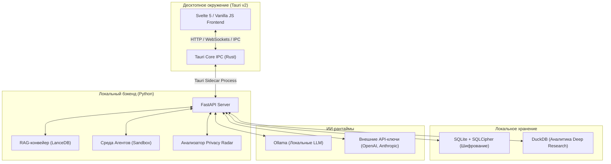

# Asterion AI — Полное руководство по сборке и реализации

Данное руководство содержит исчерпывающее техническое описание, инструкции по сборке, архитектуру интеграции Tauri v2 + FastAPI, подробный лог внедренных интерактивных улучшений и пошаговый план перехода к Фазе 2.

---

## 1. Архитектура системы и Стек

Asterion AI спроектирован как **local-first (суверенное) десктопное приложение**, оптимизированное для работы с локальными ИИ-моделями с возможностью гибридного переключения на внешние API.



### Технический стек

* **Десктопная оболочка:** Tauri v2 (Rust) — обеспечивает нативную интеграцию с ОС, минимальное потребление RAM (~50% меньше Electron) и безопасное управление sidecar-процессом.
* **Фронтенд:** HTML/JS/CSS (для прототипа) ➔ Svelte 5 + Tailwind CSS (в продакшене).
* **Бэкенд-сайдкар:** Python FastAPI — запускается как дочерний процесс (Sidecar) десктопного приложения.
* **Локальные модели:** Ollama (LLM/Embeddings) + whisper.cpp (Voice) + ComfyUI (Images).
* **Хранение:** SQLite + SQLCipher (базы переписок, памяти и логов с шифрованием AES-256), LanceDB (векторная база для RAG), DuckDB (колоночная база для аналитики).

---

## 2. Пошаговое руководство по сборке и развертыванию

### Шаг 2.1: Подготовка окружения

Установите необходимые системные компоненты:

1. **Rust & Cargo:**

   ```powershell
   # Windows (PowerShell)
   x86_64-pc-windows-msvc build tools и Rustup:
   irm https://sh.rustup.rs | iex
   ```

2. **Node.js (LTS v20+):** Установите через nvm-windows или напрямую.

3. **Python & uv:**

   ```powershell
   # Установка диспетчера окружений uv
   irm https://astral.sh/uv/install.ps1 | iex
   ```

4. **Ollama:** Скачайте с официального сайта и запустите. Скачайте базовую модель:

   ```bash
   ollama run llama3:8b
   ```

### Шаг 2.2: Инициализация проекта Tauri v2

1. Создайте заготовку приложения:

   ```bash
   npx -y create-tauri-app@latest ./ --y --template svelte-ts --manager npm --target web
   ```

2. Настройте `src-tauri/tauri.conf.json` для поддержки FastAPI в качестве сайдкара:

   ```json
   {
     "bundle": {
       "active": true,
       "targets": "all"
     },
     "productName": "Asterion AI",
     "version": "1.0.0",
     "identifier": "com.asterion.workspace",
     "app": {
       "security": {
         "csp": "default-src 'self'; connect-src 'self' http://localhost:8000 ws://localhost:8000 http://localhost:11434;"
       },
       "windows": [
         {
           "title": "Asterion AI",
           "width": 1350,
           "height": 973,
           "resizable": true,
           "fullscreen": false
         }
       ]
     },
     "bundle": {
       "externalBin": [
         "binaries/asterion-backend"
       ]
     }
   }
   ```

### Шаг 2.3: Настройка Python FastAPI (Sidecar)

1. Перейдите в директорию `backend` и инициализируйте окружение `uv`:

   ```bash
   mkdir backend
   cd backend
   uv init
   uv add fastapi uvicorn httpx pydantic sqlcipher duckdb lancedb keyring
   ```

2. Создайте точку входа FastAPI (`backend/main.py`):

   ```python
   import uvicorn
   from fastapi import FastAPI
   from fastapi.middleware.cors import CORSMiddleware
   
   app = FastAPI(title="Asterion Backend Sidecar")
   
   app.add_middleware(
       CORSMiddleware,
       allow_origins=["*"],
       allow_credentials=True,
       allow_methods=["*"],
       allow_headers=["*"],
   )
   
   @app.get("/api/health")
   async def health():
       return {"status": "nominal", "database": "connected"}
       
   if __name__ == "__main__":
       uvicorn.run(app, host="127.0.0.1", port=8000)
   ```

### Шаг 2.4: Компиляция Python Sidecar для релиза

Для интеграции Python-бэкенда в готовый десктопный бинарь Tauri, скомпилируйте его с помощью PyInstaller в единый исполняемый файл:

```bash
# Установка PyInstaller в окружение uv
uv pip install pyinstaller

# Компиляция в один исполняемый файл
pyinstaller --onefile --name asterion-backend main.py

# Перенос скомпилированного бинаря в директорию Tauri под целевой архитектурный суффикс
# (Например, asterion-backend-x86_64-pc-windows-msvc.exe)
mkdir ../src-tauri/binaries
cp dist/asterion-backend.exe ../src-tauri/binaries/asterion-backend-x86_64-pc-windows-msvc.exe
```

### Шаг 2.5: Запуск Sidecar из Rust (Tauri Core)

В `src-tauri/src/lib.rs` или `main.rs` реализуйте автоматический жизненный цикл запуска и остановки FastAPI сайдкара:

```rust
use tauri::api::process::Command;

#[tauri::command]
fn start_backend() {
    // Tauri автоматически подставит правильный суффикс архитектуры
    let (mut rx, child) = Command::new_sidecar("asterion-backend")
        .expect("failed to setup backend sidecar")
        .spawn()
        .expect("failed to spawn backend sidecar");
        
    tauri::async_runtime::spawn(async move {
        while let Some(event) = rx.recv().await {
            // Логирование вывода сайдкара в stdout приложения
            println!("{:?}", event);
        }
    });
}
```

---

## 3. Синхронизация состояния (Multi-Window State Sync)

В Tauri v2 каждое окно — это изолированный процесс WebView. Для бесшовной синхронизации состояния (например, при отправке команды в Command Palette `Cmd+K` или обновлении RAG-комнат):

1. **Rust Event Hub:** Tauri выступает в роли диспетчера событий.

2. **Вещание событий (Emit/Listen):**

   ```javascript
   // Отправка события из одного WebView
   import { emit } from '@tauri-apps/api/event';
   emit('state-changed', { roomId: 'secure-vault', action: 'update' });
   
   // Подписка на событие во всех остальных WebView
   import { listen } from '@tauri-apps/api/event';
   listen('state-changed', (event) => {
     updateLocalState(event.payload);
   });
   ```

3. **Revision Gates:** При высокой частоте обновления применяется coalescing и сверка версий состояния (`stateVersion++`), чтобы предотвратить рассинхронизацию интерфейсов.

---

## 4. Лог выполненных интерактивных улучшений в MVP ( index.html )

Мы полностью завершили интерактивную симуляцию Phase 1, создав высококлассный динамический фронтенд в `index.html`:

1. **Интеграция переключателя Model Autopilot:**
   * В чат-композер добавлен трехпозиционный селектор: **Private** (Локально), **Balanced** (Гибридно) и **Fast** (API).
   * При клике изменяется статус-бар: цвет индикатора, текстовый режим (`LOCAL MODE`, `HYBRID MODE`, `API MODE`), модель (`Llama-3 70B`, `Mistral 8x7B`, `GPT-4o API`) и аппаратные метрики (загрузка VRAM/RAM и скорость токенов).

2. **Интерактивный поповер Privacy Radar Details:**
   * При клике на индикатор приватности в статус-баре открывается поповер, детально расписывающий безопасность текущей маршрутизации, соотношение локальных и внешних запросов, а также риски передачи данных.

3. **Динамический ИИ-чат с генерацией блоков (Adaptive Artifacts):**
   * Отправка сообщения по кнопке `Send` или клавише `Enter` запускает визуальное "обдумывание" модели.
   * Чат анализирует ключевые слова ввода:
     * `code` / `redis` / `config` ➔ возвращает **CodeBlock** (код Python/Redis с рабочей кнопкой копирования, которая временно меняется на "Copied!").
     * `compare` / `metric` / `table` ➔ возвращает **TableBlock** (интерактивная таблица сравнения моделей).
     * `source` / `document` / `pdf` ➔ возвращает **SourceCard** (карточка источника из локального RAG с рейтингом доверия `Relevance`).
     * `agent` / `run` / `sim` ➔ возвращает **ActionCard** (кнопка развертывания агента в Agent Lab).

4. **Живой фильтр Knowledge Vault:**
   * Поиск в реальном времени (`id="vault-search-bar"`) мгновенно фильтрует карточки файлов по имени и AI-сводке.

5. **Image Studio Canvas Prompting:**
   * Поле ввода промпта в Image Studio считывает текст (например, "neon", "space", "green") и генерирует уникальный узор на Canvas, добавляя сгенерированную карточку в начало истории генерации.

---

## 5. План реализации Фазы 2: Smart Chat & Streaming

### Задача 5.1: FastAPI-роутеры и SSE-стриминг

Реализуйте потоковую генерацию ответов с помощью Server-Sent Events (SSE).

* **Бэкенд-эндпоинт (`backend/routers/chat.py`):**

  ```python
  import asyncio
  from fastapi import APIRouter
  from fastapi.responses import StreamingResponse
  
  router = APIRouter(prefix="/api/chat")
  
  async def mock_event_stream(prompt: str):
      words = f"Response to: {prompt}. This is a simulated local streaming response...".split()
      for word in words:
          yield f"data: {word} \n\n"
          await asyncio.sleep(0.08)
          
  @router.get("/stream/{prompt}")
  async def chat_stream(prompt: str):
      return StreamingResponse(mock_event_stream(prompt), media_type="text/event-stream")
  ```

* **Фронтенд-приемник (`src/components/Chat/Composer.svelte`):**

  ```javascript
  const eventSource = new EventSource(`http://localhost:8000/api/chat/stream/${prompt}`);
  eventSource.onmessage = (event) => {
    appendWordToActiveMessage(event.data);
  };
  eventSource.onerror = () => {
    eventSource.close();
  };
  ```

### Задача 5.2: Подключение локальной службы Ollama

Интегрируйте реальный вызов Ollama через асинхронный клиент `httpx.AsyncClient`:

```python
import httpx

class OllamaService:
    def __init__(self, base_url="http://localhost:11434"):
        self.base_url = base_url
        
    async def generate_stream(self, model: str, prompt: str):
        async with httpx.AsyncClient(timeout=30.0) as client:
            async with client.stream(
                "POST", 
                f"{self.base_url}/api/generate",
                json={"model": model, "prompt": prompt}
            ) as response:
                async for chunk in response.aiter_bytes():
                    yield chunk
```

### Задача 5.3: Интеграция PrivacyAnalyzer

Встройте анализ приватности перед выполнением запроса:

```python
from pydantic import BaseModel

class PrivacyReport(BaseModel):
    risk_level: str  # green, yellow, red
    explanation: str

class PrivacyAnalyzer:
    @staticmethod
    def analyze_payload(prompt: str, model: str, has_attachments: bool) -> PrivacyReport:
        if "sk-" in prompt:
            return PrivacyReport(risk_level="red", explanation="Found potential API keys in text prompt.")
        if model.startswith("gpt-"):
            return PrivacyReport(risk_level="red", explanation="Query will be routed to OpenAI external server.")
        return PrivacyReport(risk_level="green", explanation="Full execution on local hardware.")
```

---

## 6. Руководство по сборке релиза

Для подготовки финального установщика (MSI для Windows, DMG для macOS, AppImage/DEB для Linux):

1. Скомпилируйте веб-фронтенд:

   ```bash
   npm run build
   ```

2. Запустите сборщик Tauri (автоматически скомпилирует Rust-код и упакует Python-сайдкар):

   ```bash
   npm run tauri build
   ```

   *Результат будет расположен в директории `src-tauri/target/release/bundle/`.*
