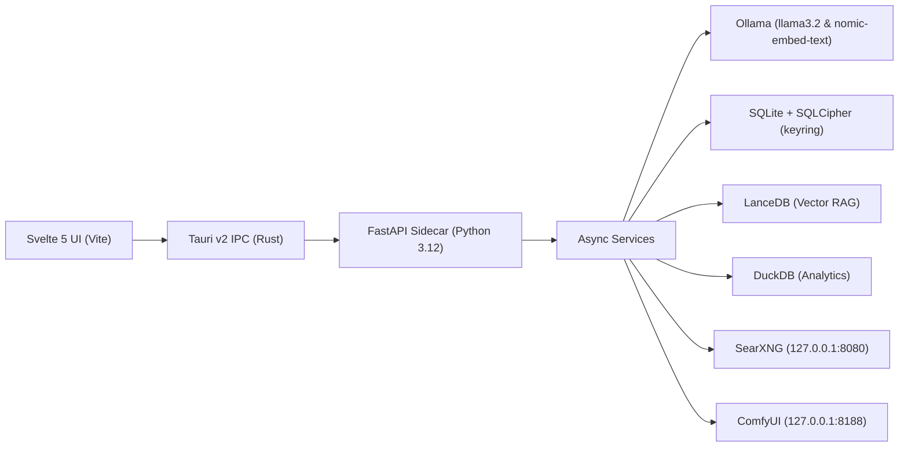

# Platform Snapshot

Asterion AI is a local-first desktop AI workspace designed for developers, researchers, and privacy-conscious power users. It functions as a secure control room for local LLMs, document vectorization (RAG), deep search, voice notes, automation workflows, and sandboxed execution of agents.

---

## 1. What It Is and Who It Serves

- **Target Audience**: Privacy-conscious developers, researchers, and technical power users.
- **Value Proposition**: A feature-rich AI interface (similar to Claude or Perplexity) that operates 100% locally on user hardware, with clear and visible privacy guardrails (Privacy Radar) and granular consent gates for any action that could leak data.

---

## 2. Current Architecture & Components

The application is structured as a hybrid desktop-sidecar application transitioning into a pure Rust architecture.

### Components Summary

- **Frontend (`/frontend`)**: Svelte 5 / Vite single-page application. Features a three-column Workbench layout (Context panel, Chat composer, right-aligned tabs for plans, logs, and artifacts), Ctrl+K Command Palette, and custom Markdown rendering.
- **Desktop Shell (`/src-tauri`)**: Tauri v2 application written in Rust. Manages the sidecar lifecycle, native system tray, hardware GPU detection, native file picker dialogs, and keyboard hotkeys.
- **Backend (`/backend`)**: FastAPI Python 3.12 application running as a PyInstaller-packaged sidecar. Houses the orchestrators for agents, databases, and third-party loopbacks.
- **Core Rust Library (`/crates/core`)**: Implements ported business logic (ModelRouter, PrivacyAnalyzer, BenchmarkService, PluginManager, ContradictionFinder, TaskSimulator).
- **Agent Sandbox**: Subprocess execution isolation. Uses Windows native `ctypes` Job Objects and macOS/Linux `RLIMIT` parameters.

---

## 3. Core Flows

### A. Smart Chat Flow
1. User enters message and hits submit.
2. Svelte UI requests `POST /api/chat/stream`.
3. `PrivacyAnalyzer` scans content for PII and checks dependencies.
4. `ModelRouter` scores model compatibility based on VRAM/RAM constraints.
5. `ChatService` orchestrates streams from local Ollama (or vLLM fallback if active) to the UI via Server-Sent Events (SSE).
6. Message is persisted to SQLCipher SQLite; responses generate Adaptive Artifact blocks.

### B. RAG indexing and Search Flow
1. Documents are dragged-and-dropped into Svelte UI or selected via native file dialog.
2. File paths are verified against Approved Folder Scopes.
3. FastAPI reads, chunks, embeds (via Ollama `nomic-embed-text`), and registers vectors in LanceDB.
4. Searches run hybrid dense cosine plus BM25 search.

### C. Deep Research Flow
1. Query received -> decomposed into subtasks by `SupervisorAgent`.
2. Agent searches via local SearXNG instance (`127.0.0.1:8080`).
3. Results are aggregated, structured, and stored in DuckDB.
4. Receipts (quotes, claims, sources) are stored in SQLCipher; contradiction checks are run by `ContradictionFinder`.

---

## 4. Environments & Deployment Flow

- **Local Development**:
  - Backend: `uv run python -m asterion_api` (default port 8000)
  - Frontend: `npm run dev` (Vite, default port 5173)
  - Tauri: `cargo tauri dev` (starts sidecar and dev console)
  - Docker Profile: `docker compose up --build` (runs backend, frontend, and SearXNG)
- **CI/CD Pipeline** (`.github/workflows/ci.yml`):
  - Automatically runs Python pytest/ruff validation, Rust workspace checks/tests, and frontend build validation on push/PR.
- **Release Pipeline** (`.github/workflows/release.yml`):
  - Compiles the Python sidecar using PyInstaller and packages it within Tauri build artifacts.

---

## 5. Blast Radius & Risks

| Zone | Potential Impact | Mitigations |
| --- | --- | --- |
| **Data Storage / SQLite** | Loss of chat history, memories, and room configuration. | Key material isolated in OS Keyring; PBKDF2-Fernet encrypted backup and import/export utility. |
| **Agent Sandbox Execution** | Arbitrary code execution leaking files or network packets. | Native Job Objects/RLIMIT caps; AST validation of imports to block `socket`, `subprocess`, and unauthorized path traversals. |
| **Plugin Ecosystem** | Malicious third-party plugins executing high-privilege APIs. | Ed25519 signature checks; automatic trust downgrade to `danger` for unsigned or corrupted manifests. |
| **Web Search & API Models** | Data leaking to external indexers or LLM providers. | Strict Consent Gates; default `web_access=false`; `PrivacyAnalyzer` classifying external routing as red risk. |

---

## 6. Known Issues & Tech Debt

1. **Compilation Toolchain**: Tauri Cargo compilation on Windows requires Visual Studio MSVC Build Tools. If `link.exe` is missing, Cargo builds fail.
2. **LanceDB deletion**: LanceDB vector data deletion needs to be hardened (currently, document references are deleted from SQLite metadata, but raw LanceDB vector blobs are scheduled for future cleanup optimization).
3. **Rust Port Completeness**: Phase 1 is complete (Router, Privacy, Benchmarks, Plugins, Contradictions, Sandbox). Core services like `ChatService` and DB layer are still running on Python FastAPI sidecar.
