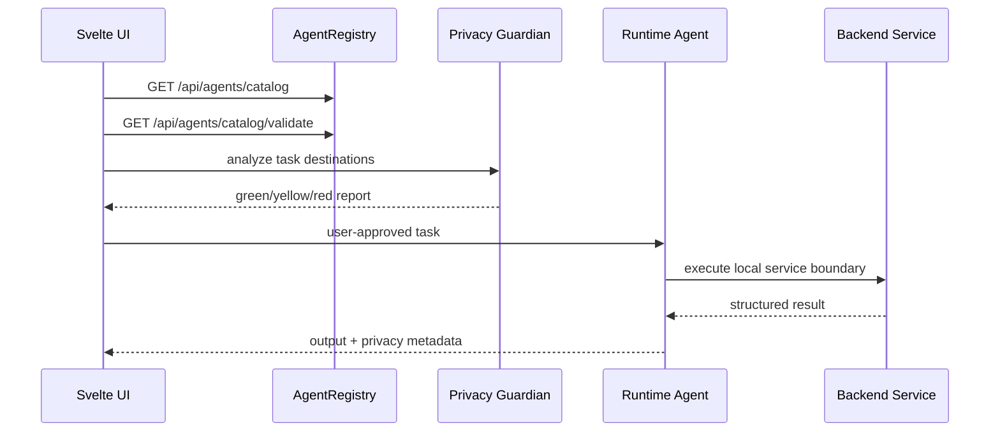

# Agents and Skills

Этот документ описывает runtime-агентов и runtime-скиллы Asterion AI.

Важно: это не Codex skills. Это декларативные JSON manifests, которые загружаются backend-сервисом `AgentRegistry` и отдаются в UI через API.

## Source of Truth

```text
agents/*.json
skills/*.json
backend/asterion_api/services/agent_registry.py
backend/asterion_api/schemas.py
```

Каталог должен проходить проверку:

```powershell
uv run python -c "from asterion_api.services.agent_registry import AgentRegistry; print(AgentRegistry().validate_catalog())"
```

Ожидаемый результат:

```json
{"ok": true, "agents_count": 10, "skills_count": 16, "errors": [], "warnings": []}
```

## API

- `GET /api/agents/catalog` - полный каталог агентов и скиллов.
- `GET /api/agents/catalog/agents` - только агенты.
- `GET /api/agents/catalog/skills` - только скиллы.
- `GET /api/agents/catalog/agents/{agent_id}` - один агент.
- `GET /api/agents/catalog/validate` - проверка ids, ссылок на скиллы и handoff targets.
- `POST /api/agents/simulate` - генерация `AgentPlan`.
- `POST /api/agents/run-code` - sandboxed Python execution.

## Runtime Agents

| Agent | Privacy | Purpose |
| --- | --- | --- |
| `chat-orchestrator` | local | Streaming chat, room context, local persistence |
| `privacy-guardian` | local | Privacy Radar decisions and consent gates |
| `model-curator` | local | Ollama catalog and local/API routing decisions |
| `memory-curator` | local | Room-scoped encrypted memory lifecycle |
| `rag-librarian` | local | Local document indexing and hybrid search |
| `research-supervisor` | hybrid | Deep research with local SearXNG and DuckDB aggregation |
| `sandbox-runner` | local | AgentPlan and isolated Python subprocess execution |
| `workflow-operator` | local | Workflow execution and human approval gates |
| `plugin-auditor` | local | MCP plugin trust review and permission mapping |
| `image-studio` | local | Local ComfyUI image generation |

## Runtime Skills

| Skill | Category | Service/tool boundary |
| --- | --- | --- |
| `agent-catalog-governance` | agents | `AgentRegistry` validation |
| `conversation-orchestration` | chat | `ChatService`, `PrivacyAnalyzer`, `ModelRouter` |
| `streaming-chat` | chat | `StreamingResponse`, SSE, Svelte `EventSource` |
| `privacy-radar` | safety | `PrivacyAnalyzer` |
| `model-routing` | models | `ModelRouter` |
| `ollama-operations` | models | `OllamaService`, async `httpx` |
| `sqlcipher-storage` | storage | `EncryptedSQLiteStore`, `keyring`, `sqlcipher3` |
| `rag-indexing` | knowledge | `DocumentIndexer`, LanceDB, BM25 |
| `memory-ledger` | memory | `MemoryLedger`, SQLCipher |
| `deep-research` | research | `SupervisorAgent`, SearXNG, DuckDB |
| `contradiction-finder` | research | embeddings plus sentiment opposition |
| `task-simulation` | agents | `TaskSimulator` |
| `sandboxed-code` | agents | `AgentSandbox` |
| `comfyui-generation` | images | `ComfyUIService` |
| `workflow-automation` | automation | `WorkflowRunner`, WebSocket events |
| `plugin-management` | plugins | `PluginManager` |

## Agent Manifest Contract

```json
{
  "id": "chat-orchestrator",
  "name": "Chat Orchestrator",
  "version": "0.2.0",
  "role": "Coordinates local chat.",
  "description": "Runtime description for UI and governance.",
  "privacy_level": "local",
  "default_model": "llama3.2",
  "triggers": ["user_message"],
  "skills": ["conversation-orchestration", "privacy-radar"],
  "permissions": {
    "allowed_folders": [],
    "network": false,
    "shell": false
  },
  "lifecycle": ["analyze privacy", "select model", "stream response"],
  "outputs": ["ChatResponse", "SSE token events"],
  "handoff_targets": ["privacy-guardian"],
  "acceptance_checks": ["SSE emits token events."],
  "system_prompt": "Runtime system prompt.",
  "escalation_policy": "When to ask the user for approval."
}
```

Rules:

- `id` must be stable, lowercase, and unique.
- `privacy_level` is one of `local`, `hybrid`, `external`.
- `skills[]` must reference existing `skills/*.json`.
- `handoff_targets[]` must reference existing `agents/*.json`.
- `permissions.network=true` is not allowed silently; it must be justified by privacy level and consent flow.
- Never put secrets, tokens, host credentials, live paths, or personal data in manifests.

## Skill Manifest Contract

```json
{
  "id": "privacy-radar",
  "name": "Privacy Radar",
  "version": "0.2.0",
  "owner": "asterion",
  "category": "safety",
  "description": "Classifies risk.",
  "privacy_level": "local",
  "triggers": ["privacy_check_requested"],
  "inputs": ["model_type"],
  "outputs": ["PrivacyReport"],
  "tools": ["PrivacyAnalyzer"],
  "guardrails": ["External API model use is red risk."],
  "requires_consent": ["external_model"],
  "failure_modes": ["Missing user consent."],
  "acceptance_checks": ["Response level is green, yellow, or red."]
}
```

Rules:

- Skills describe capability contracts, not implementation code.
- `tools[]` must name backend services or local interfaces.
- `requires_consent[]` must include any external model, web, shell, file, memory, or plugin elevation.
- `acceptance_checks[]` must be concrete enough for Meta-Harness or smoke tests.

## Execution Flow



## Permission Matrix

| Capability | Default | Consent required |
| --- | --- | --- |
| Local Ollama chat | allowed | no |
| SQLCipher conversation storage | allowed | no |
| Memory write | gated | yes when sensitive or user-triggered |
| File indexing | gated | yes for attached files and broad folders |
| SearXNG web research | gated | yes |
| API model fallback | blocked | yes |
| Plugin network/file/shell/danger | blocked | yes |
| Python sandbox network/shell | blocked | yes |
| ComfyUI localhost generation | allowed | no |
| External image service | blocked | yes |

## Release Checklist

Before shipping agent or skill changes:

```powershell
uv run python -m compileall backend\asterion_api harness\meta_harness.py
uv run python harness/meta_harness.py --phase 1 --iterations 3
```

Then verify:

- `GET /api/agents/catalog/validate` returns `ok=true`.
- Every agent has `acceptance_checks`.
- Every skill has `acceptance_checks`.
- Elevated capabilities are represented in `requires_consent`.
- `docs/updates.md` records the manifest/API change.
