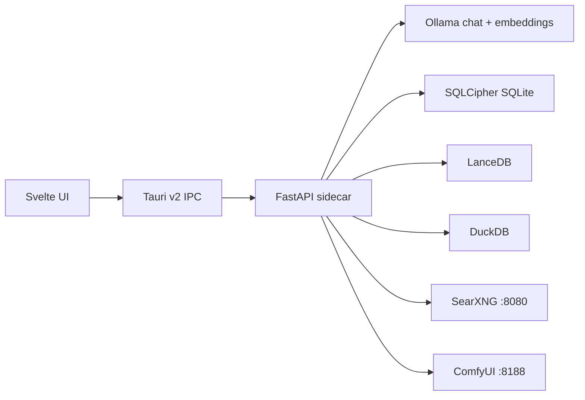

# Architecture

Asterion AI uses a local-first desktop architecture.

## Backend

The backend is in `backend/asterion_api`.

Core modules:

- `main.py` creates the FastAPI app and includes routers.
- `dependencies.py` wires singleton services.
- `harness.py` defines `BaseHarness`.
- `structured_logging.py` defines JSON logs.
- `schemas.py` contains pydantic contracts.

## Services

- `OllamaService`: local model discovery, generation, streaming, embeddings.
- `ChatService`: conversation orchestration and persistence.
- `EncryptedSQLiteStore`: SQLCipher schema and storage operations.
- `PrivacyAnalyzer`: Privacy Radar risk classification.
- `ModelRouter`: local/API model selection based on VRAM.
- `DocumentIndexer`: file parsing, chunking, embeddings, LanceDB upsert, hybrid search.
- `MemoryLedger`: room-scoped memory CRUD with privacy check.
- `SupervisorAgent`: deep research decomposition and SearXNG search.
- `ContradictionFinder`: claim similarity plus opposing sentiment detection.
- `TaskSimulator` and `AgentSandbox`: agent planning and isolated subprocess execution.
- `ComfyUIService`: local image generation bridge.
- `WorkflowRunner`: sequential workflow execution with approval gates.
- `PluginManager`: MCP plugin manifest loading.
- `AgentRegistry`: runtime agent and skill manifest loading.

## Desktop Shell

`src-tauri/src/lib.rs` defines Tauri commands:

- `start_fastapi_sidecar`
- `fastapi_health_check`
- `shutdown_fastapi_sidecar`

The sidecar binary name is `asterion-backend`.

## Data Flow

1. UI sends chat request to FastAPI.
2. Privacy Radar classifies risk.
3. ModelRouter selects local model when possible.
4. ChatService calls Ollama.
5. Responses stream via SSE or return as JSON.
6. Messages and memories persist in encrypted SQLite.
7. RAG uses local file chunks and local embeddings in LanceDB.

## Local-First Boundary

Local:

- Ollama
- SQLCipher SQLite
- LanceDB
- DuckDB
- ComfyUI when running on localhost

Hybrid:

- SearXNG public web search through local instance
- Plugins with network/file/shell trust levels

External:

- API model fallback
- Any non-local image/model/search provider
