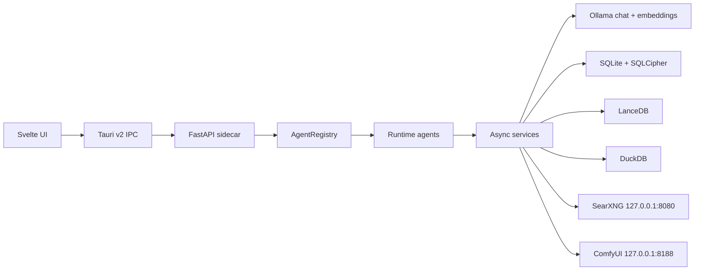
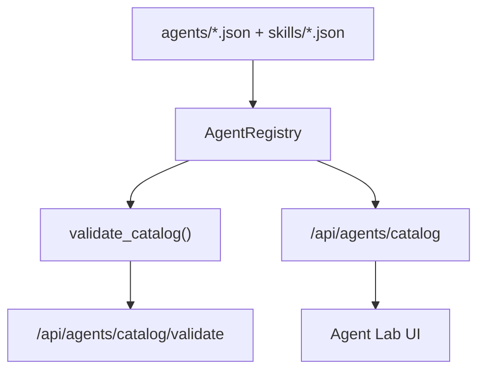
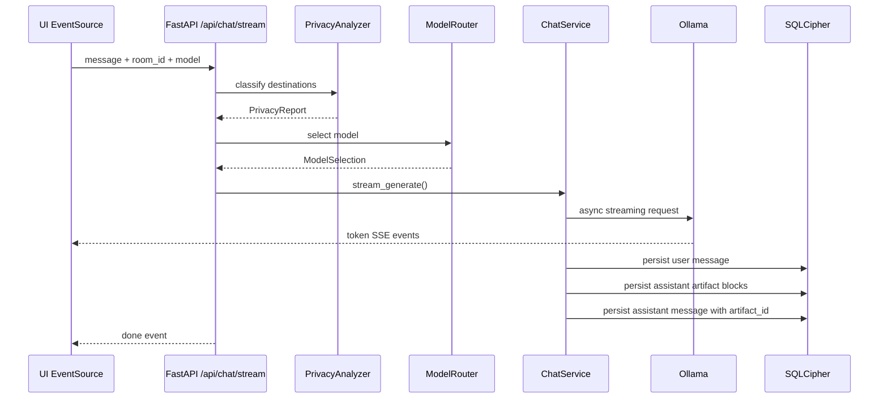
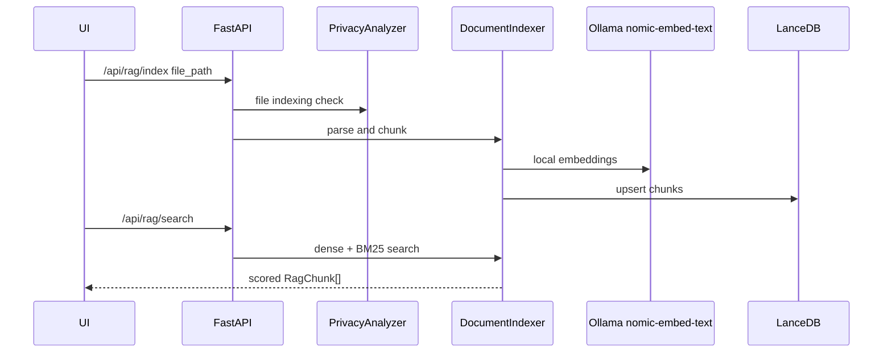
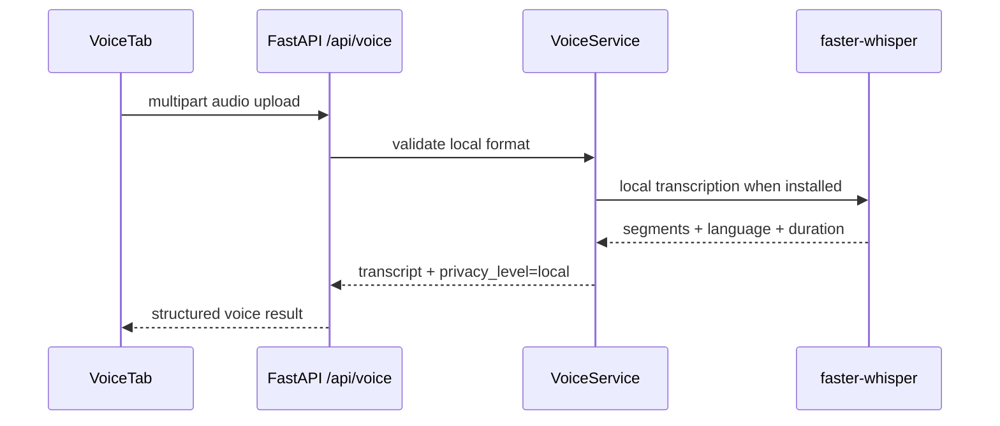

# Architecture

Asterion AI is a local-first desktop AI workspace.

Default rule: prompts, files, memories, embeddings, generated artifacts, and chat history stay on the user's machine.

## High-Level System



## Repository Layout

```text
backend/       FastAPI sidecar and async services
frontend/      Svelte/Vite app shell
src-tauri/     Tauri v2 Rust desktop shell
agents/        Runtime agent manifests
skills/        Runtime skill manifests
harness/       Meta-Harness checks
docs/          Engineering source of truth
stitch/        UI prototype exports
```

## Backend

The backend lives in `backend/asterion_api`.

Core files:

- `main.py` creates the FastAPI app and includes routers.
- `dependencies.py` wires singleton services.
- `harness.py` defines `BaseHarness`.
- `structured_logging.py` emits structured logs.
- `schemas.py` contains pydantic v2 API and manifest contracts.

Every service optimized or inspected by Meta-Harness must implement:

- `execute()`
- `get_state()`
- `set_state()`

## Frontend

The frontend lives in `frontend/` and runs as a Svelte/Vite app during development.

Primary files:

- `frontend/src/App.svelte` - command center layout.
- `frontend/src/lib/StreamingChat.svelte` - browser `EventSource` streaming chat client with SQLCipher history reload.
- `frontend/src/lib/api.ts` - typed FastAPI client.
- `frontend/src/lib/tauri.ts` - Tauri IPC bridge for sidecar lifecycle commands with browser fallback.
- `frontend/src/app.css` - responsive operational UI styles.

The first screen is the workspace itself: live chat, Privacy Radar, Model Router, Agent Catalog, Memory Ledger, RAG search, and Task Simulator.

Default API base:

```text
http://127.0.0.1:8000
```

## Service Boundaries

| Service | Responsibility | Privacy |
| --- | --- | --- |
| `OllamaService` | local chat, streaming, embeddings | local |
| `ChatService` | conversation orchestration and persistence | local |
| `EncryptedSQLiteStore` | SQLCipher schema and encrypted records | local |
| `PrivacyAnalyzer` | green/yellow/red risk report | local |
| `ModelRouter` | local/API route selection | local |
| `DocumentIndexer` | parse, chunk, embed, LanceDB upsert/search | local |
| `MemoryLedger` | room memory CRUD with privacy gate | local |
| `SupervisorAgent` | research decomposition and SearXNG search | hybrid |
| `ContradictionFinder` | claim similarity and opposing sentiment | local |
| `TaskSimulator` | `AgentPlan` generation | local |
| `AgentSandbox` | isolated Python subprocess execution | local |
| `ComfyUIService` | localhost image generation bridge | local |
| `WorkflowRunner` | workflow steps and approval gates | local |
| `PluginManager` | local plugin manifest loading | local |
| `AgentRegistry` | manifest loading and validation | local |
| `VoiceService` | local audio transcription and voice-note structuring | local |

## MVP Data Contracts

New MVP contracts persist in SQLCipher:

- `rooms`: Context Rooms and retention/model/memory policy.
- `rag_documents`: Knowledge Vault document metadata.
- `artifacts`: Adaptive Artifact blocks generated by chat, research, code, workflow, and export flows.
- `research_receipts`: source-backed research claims.
- `agent_runs`: Agent Lab run state and permission snapshot.
- `agent_logs`: Flight Recorder events.

## Agent Runtime

Runtime agents are declarative. The backend does not hard-code an agent list; it reads `agents/*.json` and `skills/*.json`.



Validation checks:

- duplicate agent and skill ids
- malformed manifests
- agents referencing unknown skills
- agents referencing unknown handoff targets
- local agents that silently request network or shell
- missing acceptance checks
- external skills without consent declarations

## Chat Flow



## RAG Flow



## Voice Flow



If `faster-whisper` is not installed, `VoiceService` returns a local fallback response
with setup instructions and does not call any external speech API.

## Desktop Shell

`src-tauri/src/lib.rs` exposes:

- `start_fastapi_sidecar`
- `fastapi_health_check`
- `shutdown_fastapi_sidecar`

The expected sidecar binary name is `asterion-backend`.

`src-tauri/tauri.conf.json` points desktop builds at the Svelte app:

```json
{
  "build": {
    "beforeDevCommand": "npm --prefix ../frontend run dev",
    "beforeBuildCommand": "npm --prefix ../frontend run build",
    "frontendDist": "../frontend/dist",
    "devUrl": "http://127.0.0.1:5173"
  }
}
```

The Svelte UI calls the Tauri commands only when the Tauri runtime is present. In browser mode, it uses the configured FastAPI URL directly.

## Storage

Main database:

- SQLite with SQLCipher
- schema managed by `EncryptedSQLiteStore`
- key material from OS keychain through `keyring`
- no production secrets in `.env`

Tables:

- `conversations(id, room_id, created_at)`
- `messages(id, conv_id, role, content, model, artifact_id, ts)`
- `memories(id, room_id, content, source, created_at, expires_at)`
- `rooms(id, name, color, allowed_models, memory_policy, retention_days, created_at, updated_at)`
- `rag_documents(id, room_id, source, indexed_chunks, created_at)`
- `artifacts(id, room_id, kind, title, blocks, source, created_at)`
- `research_receipts(id, report_id, source_title, url, quote, claim, confidence, ts)`
- `agent_runs(id, agent_id, room_id, status, plan, permissions, created_at, updated_at)`
- `agent_logs(id, run_id, ts, action, tool, input, output, model, privacy_level, error)`

Vector store:

- LanceDB embedded local database
- Ollama `nomic-embed-text` embeddings
- dense cosine plus BM25 hybrid search

Research aggregation:

- DuckDB local in-process analytics

## Privacy Boundary

Local:

- Ollama
- SQLCipher SQLite
- LanceDB
- DuckDB
- localhost ComfyUI
- local plugin discovery

Hybrid:

- local SearXNG gateway for public web search
- plugins with declared network/file/shell trust levels

External:

- API model fallback
- non-local search/model/image providers
- remote plugins

External and elevated routes require explicit user approval before execution.
