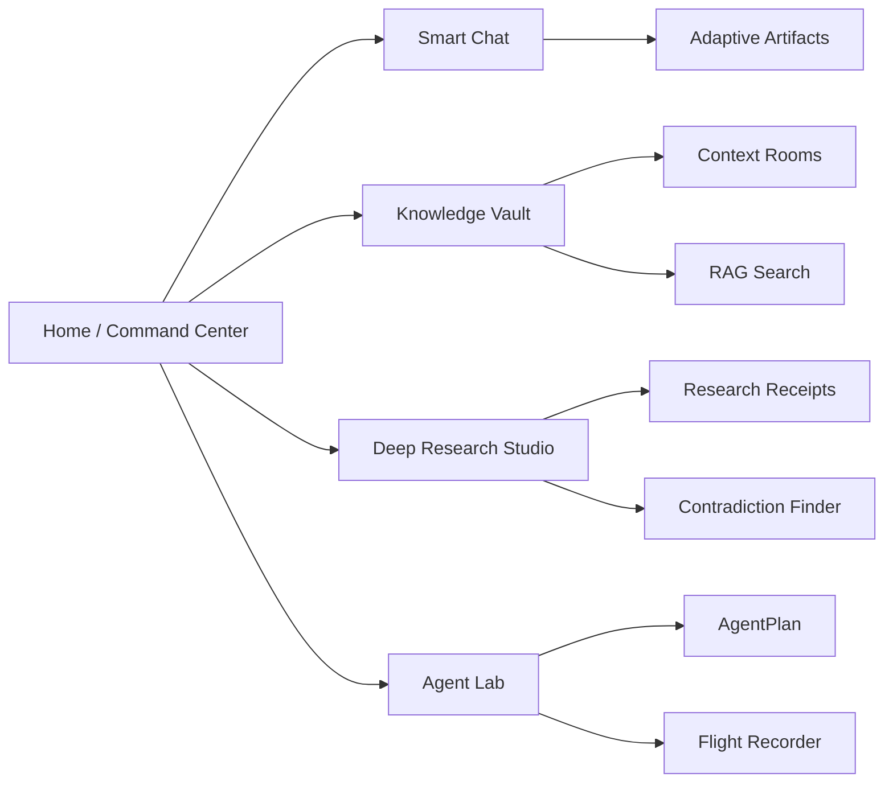

# Power-user MVP Product Plan

Asterion AI MVP is a local-first AI Control Room for developers, researchers, and privacy-conscious AI power users.

## MVP Surfaces

1. **Home / Command Center**
   - System status: FastAPI sidecar, Ollama, SQLCipher, catalog validation.
   - Privacy summary: current green/yellow/red state and risk items.
   - Model summary: selected model, route mode, hardware profile.
   - Quick actions: chat, index file, research receipt, agent plan.

2. **Smart Chat**
   - SSE streaming tokens.
   - Context room selector.
   - Model Router controls.
   - Privacy Radar ribbon before elevated operations.
   - Adaptive Artifact blocks: text, code, table, source, action.

3. **Knowledge Vault**
   - Context Rooms with retention and memory policy.
   - RAG document metadata list.
   - Local indexing with explicit file consent.
   - Semantic search scoped by room.

4. **Deep Research Studio**
   - Research goal.
   - Subtasks and sources.
   - Research Receipt cards: source, quote, claim, confidence.
   - Contradiction flags.
   - Export to structured artifact.

5. **Agent Lab**
   - Agent catalog and selected runtime agent.
   - Task Simulator for AgentPlan.
   - Permission review table.
   - AgentRun creation.
   - Flight Recorder logs with action, tool, privacy_level, and error.

## IA Map

## Clickable Flow Spec

Primary demo flow:

1. Launch Asterion AI.
2. Start or health-check the FastAPI sidecar.
3. Select the default Context Room.
4. Send a local chat message.
5. Index or inspect a local Vault document.
6. Run room-scoped RAG search.
7. Export one Research Receipt as an artifact.
8. Generate an AgentPlan.
9. Create an AgentRun.
10. Review Flight Recorder logs.

Expected user-visible outcome:

- The user can prove data stayed local unless Privacy Radar reports otherwise.
- Every generated output is either a chat response, artifact, research receipt, or agent log.
- The UI always shows the current room, model route, and privacy state.

## Design QA Checklist

- No overlapping text at 375px, 768px, 1280px, and 1440px widths.
- All panels have empty states.
- All async actions have visible status or error text.
- Privacy state is visible before elevated routes.
- Stop/deny paths are visible for agent and workflow actions.
- Buttons use concrete commands, not vague labels.
- Tables or wide logs collapse into cards on mobile.
- No decorative hero page appears before the workspace.
